# webtoonReview
✏️웹툰 리뷰 프로그램📚

[개발 일지 << click !](https://hxerimione.notion.site/8ea0b690f3c1413881e2963be650f2b9?v=e4a9cb79b12f4ff59b769929d930fdcc)

[WRiter 웹사이트 << click !](https://webtoon-review.herokuapp.com/)

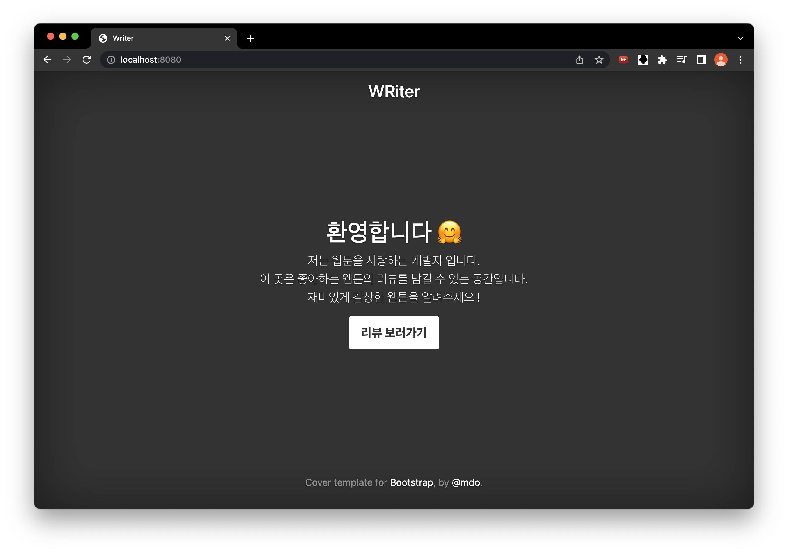
 
 

### 서비스 핵심 기능

---

#### 1.간편 로그인

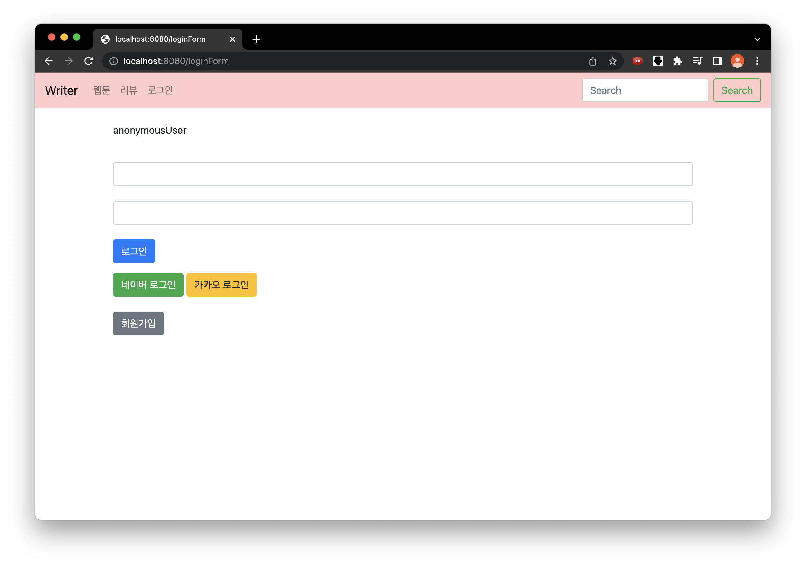

`일반로그인` `네이버` `카카오`
3가지 간편 로그인을 지원하고 있습니다.

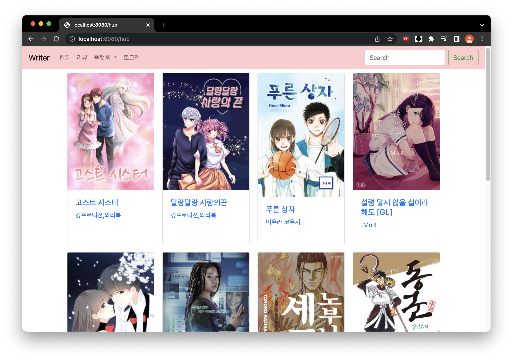 |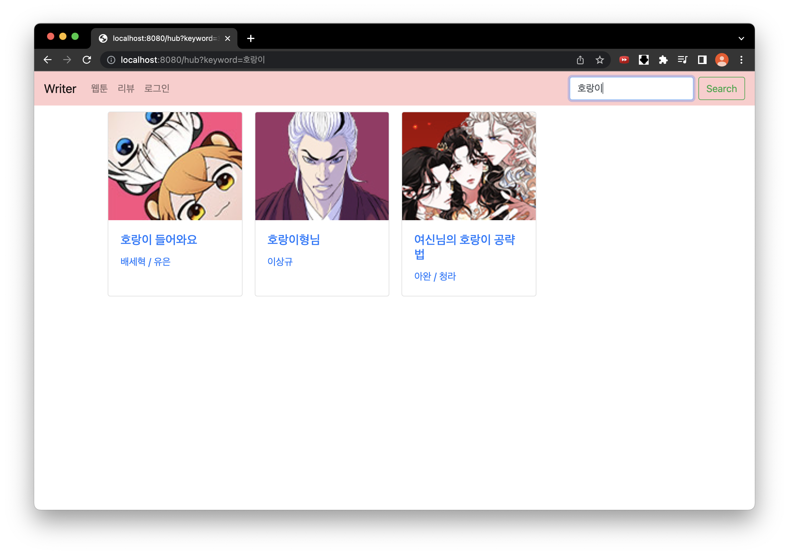
--- | --- | 

웹툰 검색이 가능합니다.

2023/02 기준 약 2000개의 웹툰이 저장되어있습니다.

#### 2.리뷰 작성

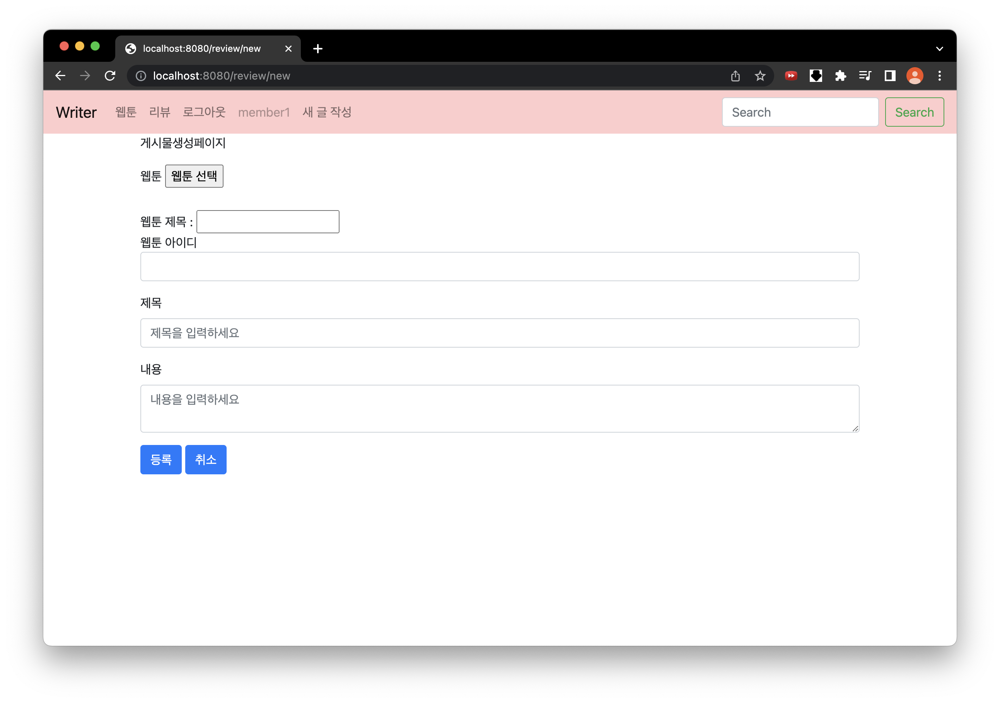

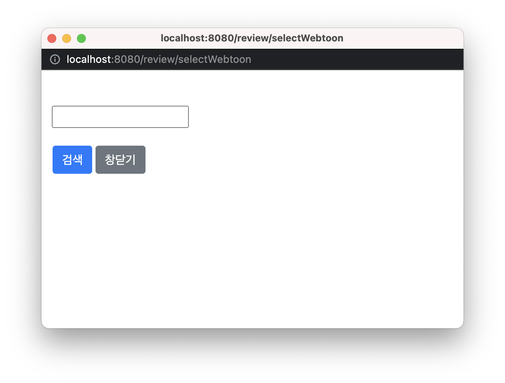 |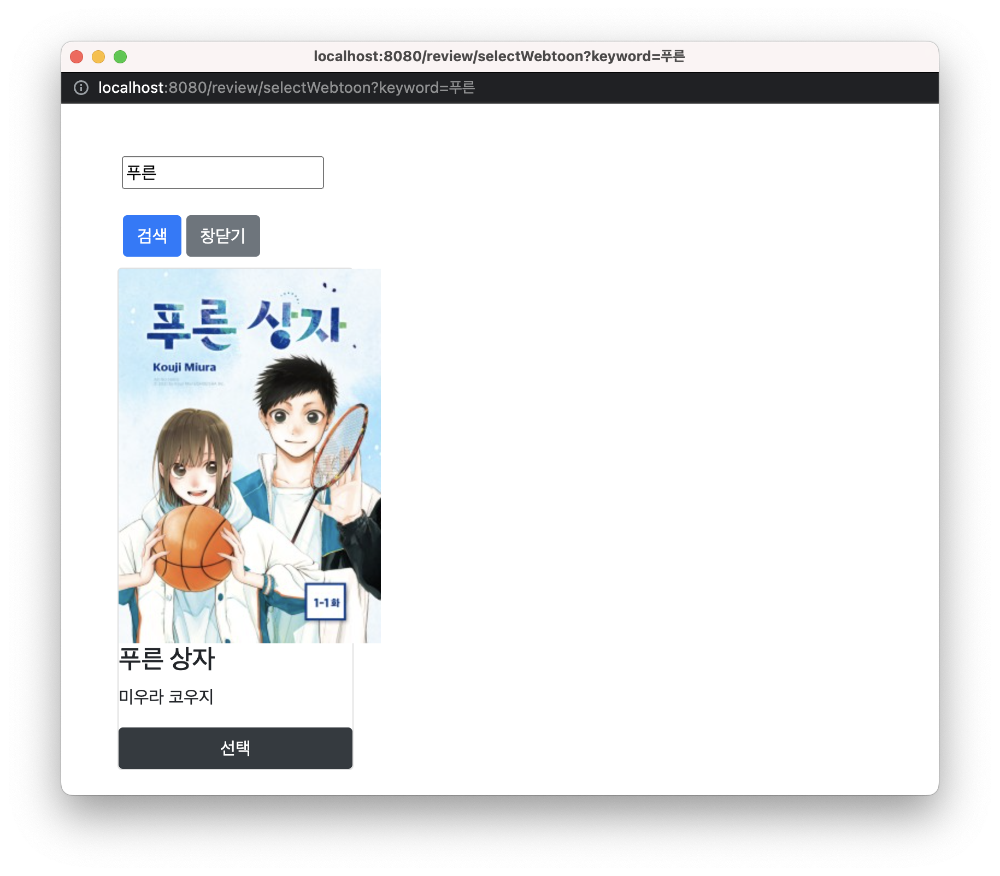
--- | --- | 

웹툰을 선택해서 리뷰를 작성할 수 있습니다.

##### 결과 화면

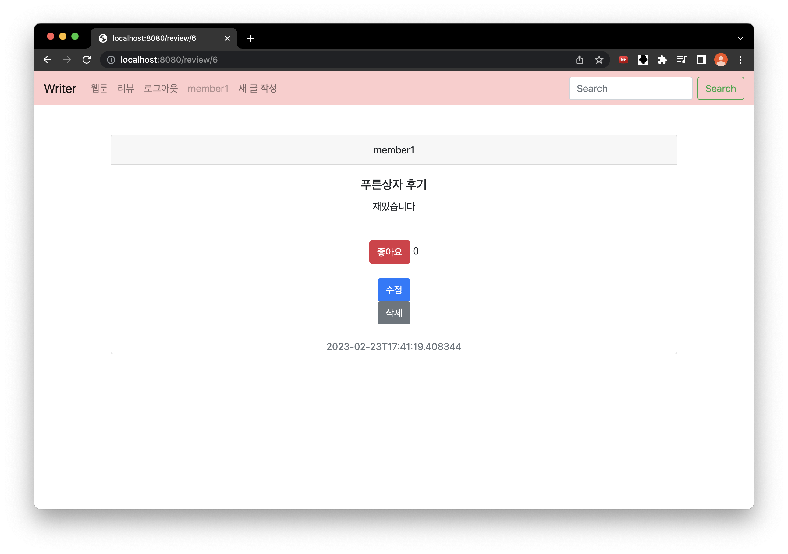

#### 3.리뷰 수정 및 삭제

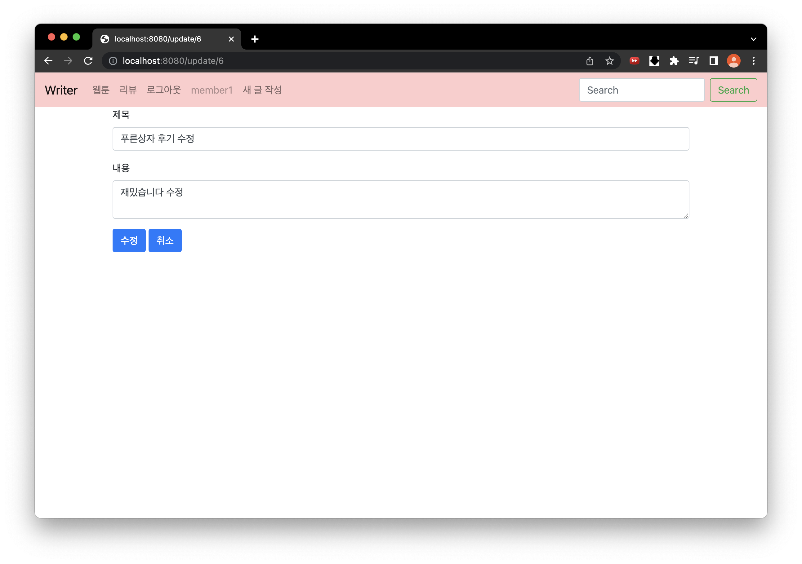 |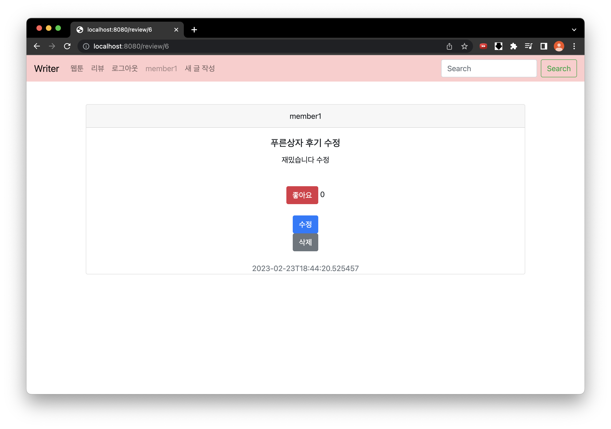
--- | --- | 

리뷰 수정 및 삭제가 가능합니다.

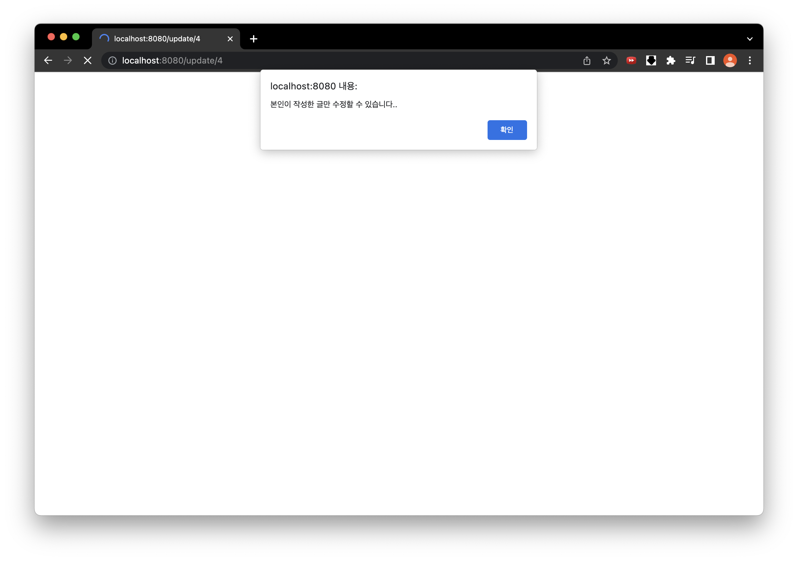

내가 작성하지 않은 리뷰는 수정할 수 없습니다.

#### 4.추천
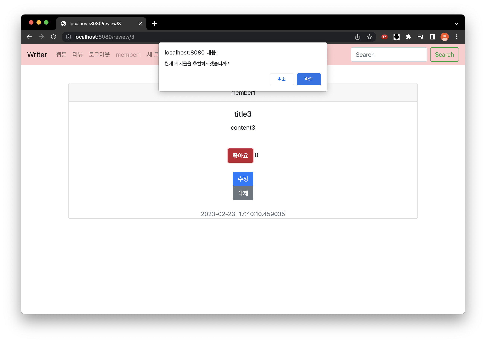 |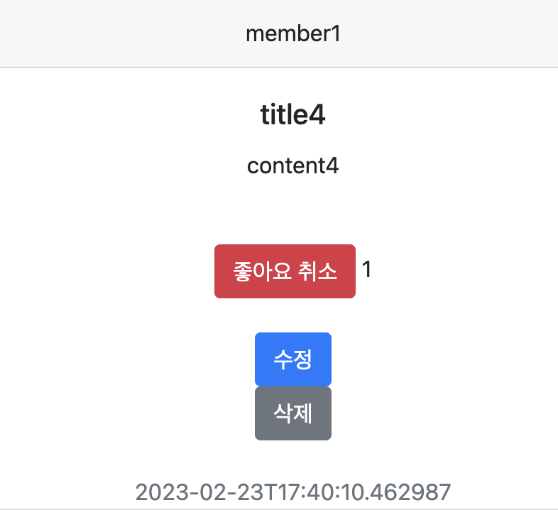
--- | --- | 

리뷰에 좋아요를 누를 수 있습니다. 추천하게되면 추천수가 +1 됩니다.

### 사용 스킬 & 기술

---

- Java 11
- Spring Boot 2.7.7
- Gradle
- MySQL
- MongoDB
- Spring Data JPA
- Intellij

 